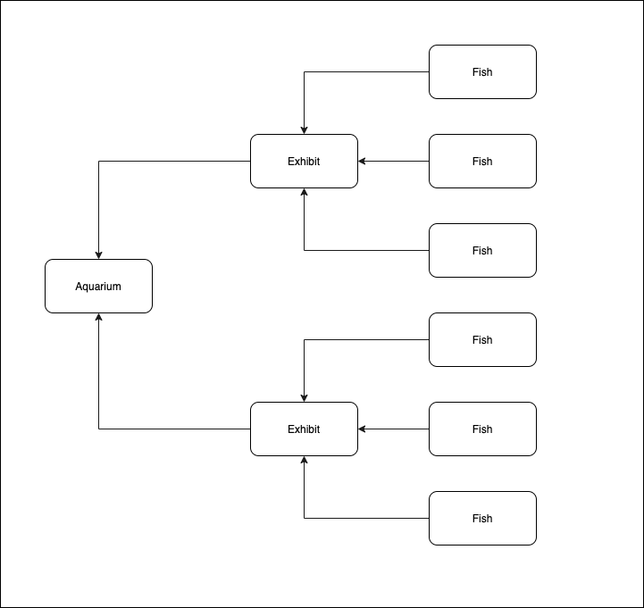

# Twitter Many to many

# Notes
- Object relationships happen on the instance level
- Methods that interact with other instances are instance methods.

## Goals
* Implement both sides of a many to many relationship
* Practice keeping groups of data related to instances of a class on the class as a class variable
* Demonstrate single source of truth by not storing collections of objects on other objects
* Demonstrate single source of truth for object relationships by emphasizing the connection between the belongs_to relationship and persistence.

How to follow along. We'll be reading through the specs as we write some code and test out the behavior. The `01_examples_spec.rb` file contains the rspec code we'll be running as we demonstrate what we know about relationships so far. The `02_exercise_spec.rb` file contains the rspec code you'll use when you work together to complete the many to many relationship between users and tweets in our twitter domain.

## Examples

For our examples, we'll be demonstrating:
1. how to implement a has_many, through relationship with a domain of `Aquarium`, `Exhibit` & `Fish`.
2. how to implement a many-to-many relationship with a domain of `Doctor`, `Appointment` & `Patient`.



## Exercise

You can run the tests for the exercise with the following command:

```bash
rspec spec/02_exercise_spec.rb --f-f
```
This will give you one error at a time that you can work through. To start, you'll have this code already written: 

```rb
# user.rb
class User 
  @@all = []

  def self.all 
    @@all 
  end
  attr_reader :username
  def initialize(username)
    @username = username
    @@all << self
  end

  def post_tweet(message)
    Tweet.new(message, self)
  end

  def tweets
    Tweet.all.select { |tweet| tweet.user == self}
  end

end
```

```rb
# tweet.rb
class Tweet 
  @@all = []

  def self.all
    @@all
  end

  attr_reader :message, :user
  def initialize(message, user)
    @message = message
    @user = user
    @@all << self
  end

  def username 
    user.username
  end

  def delete 
    Tweet.all.delete(self) 
  end

end
```

```rb
# like.rb
class Like 
  @@all = []
  def self.all 
    @@all 
  end

  def initialize(tweet, user)
    @tweet = tweet 
    @user = user
    @@all << self
  end
end
```

The basics of all 3 classes are built out for you, much like the finished code from the previous lecture on twritter_one_to_many. What's left to do is to add the association methods to this class to establish a many to many relationship between `User` and `Tweet` through likes.